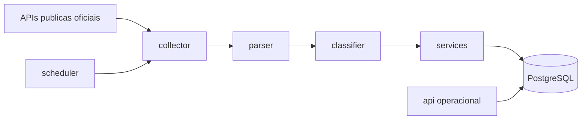

# Arquitetura

## Visao geral

HERMES foi desenhado como uma plataforma operacional backend, sem interface grafica e sem fluxo dependente de perguntas do usuario. A operacao principal e continua: coletar, armazenar, classificar e preservar historico de publicacoes oficiais.

## Containers

- `postgres`: banco principal e persistente.
- `migrator`: aplica migracoes antes dos demais servicos.
- `api`: expoe `/health`, `/version` e futuramente consultas operacionais.
- `worker`: executa o scheduler e dispara ciclos de coleta.

Separar API e worker evita que coleta continua dependa do processo HTTP. Na VPS, os dois podem ser monitorados e escalados separadamente.

## Modulos

- `collector`: contratos para fontes oficiais e registro de coletores.
- `parser`: normalizacao inicial de payloads e textos.
- `classifier`: interface de classificacao. Hoje ha classificador por palavras-chave; DeepSeek entra futuramente por outro adapter.
- `scheduler`: jobs e processo worker.
- `database`: engine, sessoes, modelos SQLAlchemy e health check.
- `api`: endpoints operacionais, sem UI.
- `services`: regras de ingestao, deduplicacao, versionamento e hashing.
- `config`: leitura de `.env` e logging.
- `logs`: espaco reservado para logs locais quando necessario. Em Docker, a saida principal e stdout.
- `scripts`: rotinas operacionais.
- `docs`: memoria arquitetural.

## Fronteiras importantes

HERMES e independente de qualquer outro projeto. Nao deve importar codigo, configuracao, tabelas, filas, volumes, credenciais ou convencoes internas de projetos externos.

## Escalabilidade planejada

A Fase 1 cria indices para busca por fonte, hash, datas, UF, municipio, tipo, tags, palavras-chave e texto. Para dezenas de milhoes de registros, as proximas fases devem avaliar particionamento por data de publicacao ou data de coleta, replicas de leitura, retencao de arquivos em storage externo e filas dedicadas.

