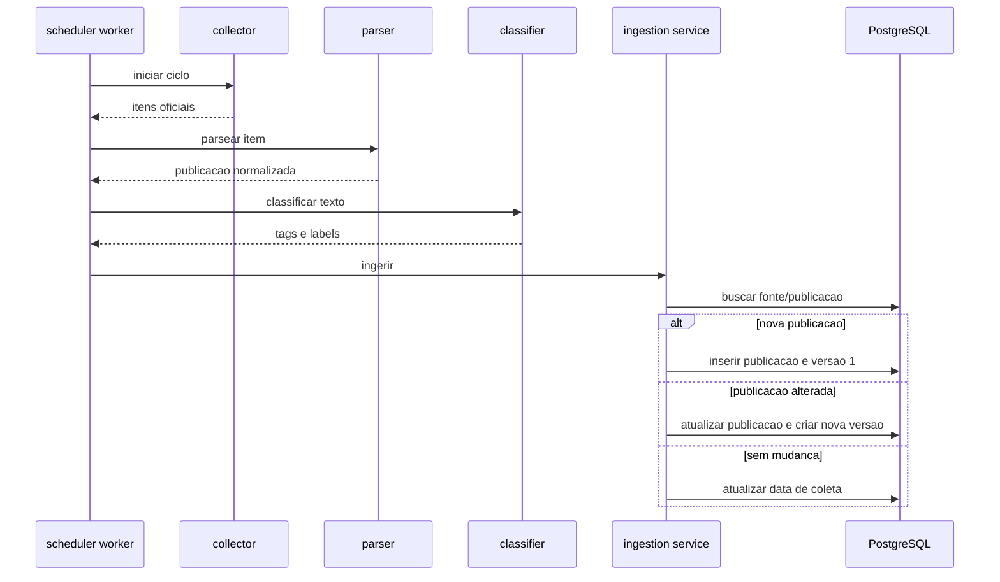

# Fluxo da plataforma

## Ciclo de coleta

## Estados de coleta

- `running`: ciclo em andamento.
- `success`: ciclo finalizado sem erro.
- `failed`: ciclo interrompido com erro registrado.

## Deduplicacao

A ordem de identificacao e:

1. `source_id + external_id`, quando a API fornece identificador estavel.
2. `source_id + content_hash`, quando nao ha identificador externo.

O hash considera payload bruto e texto original para reduzir risco de colisao operacional.

## Classificacao

Na Fase 1, a classificacao por palavras-chave serve como adapter inicial e validacao de fluxo. A integracao com DeepSeek deve implementar a mesma interface `PublicationClassifier`, sem alterar ingestao, parser ou banco principal.

